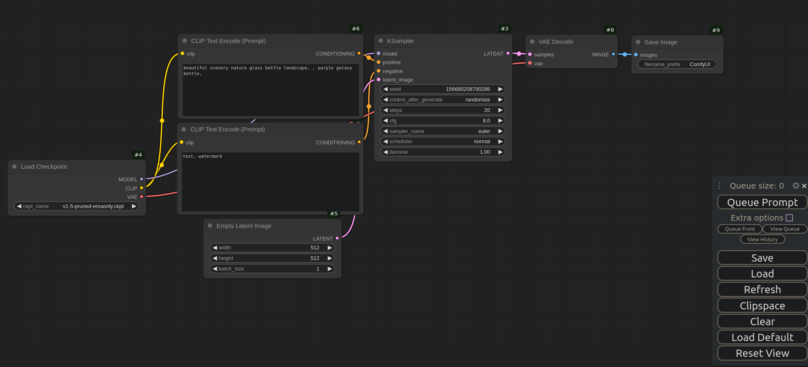

<p align="center">
  
</p>

# VantTec's Synthetic Data Repository

This is the Vanttec's repository used for synthetic data generation used to feed image segmentation and object detection models. It runs with docker containers and a GPU, but a simplified version can be run without GPU.

<!-- TABLE OF CONTENTS -->
<summary>Table of Contents</summary>
<ol>
  <li>
    <a href="#installation">Installation</a>
    <ul>
      <li><a href="#">LoRAs</a></li>
    </ul>
  </li>
  <li>
    <a href="#usage">Usage</a>
  </li>
</ol>


## Installation
 
```Shell
cd
git clone --recurse-submodules https://github.com/vanttec/vanttec_synthdata.git
```

Inside the /vanttec_uuv/dockerfiles/ directory you would two options to select: 
* ubuntu2204
* ubuntu2204_gpu

Each option contains a Dockerfile (image) and their respective create_container.bash, so please select the one that suits you the most and continue:

```Shell
cd ~/vanttec_uuv/dockerfiles/{selected_option}
docker build -t uuv_synth .
./create_container.bash
docker exec -it uuv_synth /bin/bash
```

### Low Rank Adaptation (LoRA)

The diffuser model should also be trained for generating images with custom objects. [LoRA](https://arxiv.org/pdf/2106.09685) is an efficient way to train a custom diffuser model. To train a LoRA, [Koya SS](https://github.com/bmaltais/kohya_ss) and [ComfyUi](https://github.com/comfyanonymous/ComfyUI) is used.

The KohyaSS and ComfyUi projects are already on the repo. To install them, please use a python virtual environment and add the [wasnode](https://github.com/WASasquatch/was-node-suite-comfyui) for saving multiple images at once within the ComfyUi.

## Usage
<div align="center">
  <a href="">
    
  </a>
</div>

## Results

Underwater scenary: https://huggingface.co/Ivan5d/lora_deep_sea. Trigger words: UNDERWATER_SCENE, aqua

Terrestrial scenary: 

Aerial scenary:

This is a example image obtained from the test.py script using a custom lora, stable diffusion v-1.5 and controlnet.

<div align="center">
  <a href="">
    
  </a>
</div>

## Troubleshooting

The PyTorch-CUDA setup used by bitsandbytes is mismatched with the host computer: https://huggingface.co/docs/bitsandbytes/main/en/installation